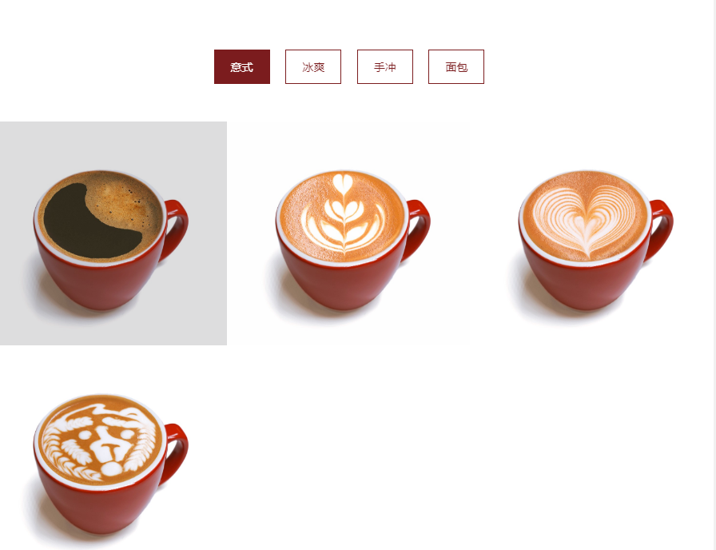

# 🔎商业分析

### 1. **市场分析：社交平台 vs 自有平台**

- **社交平台：**
    - **流量效应**：抖音和小红书具有海量用户，抖音的日活跃用户已超**7亿**，而小红书也有**2亿**多的活跃用户。这些平台能带来巨大的曝光和低成本营销机会，尤其是通过**短视频营销**的方式能够快速引起关注。例如，抖音上许多产品的爆红，都是通过网红或达人分享而带来的，这种“现象级”的传播效果在短期内可以带来可观的销量。
    - **案例**：某小众茶饮品牌，通过抖音达人和小红书种草的营销模式，在一个月内获得了近10万订单，几乎没有额外的广告成本。这显示了社交平台在引流上的强大效果，适合精品咖啡豆特色产品。
- **自有平台：**
    - **流量可控性与长尾效应**：尽管社交平台的流量大，但这种流量往往是波动的，且高度依赖平台算法。对比之下，自有小程序、APP可以累积自己的忠实用户，建立**长期客户资产**。虽然短期内流量不如社交平台大，但通过精准营销、会员制度等方式，能逐步建立稳定的用户群体，尤其是高端精品咖啡的市场，这类消费者更注重品牌认同感和长期的购买体验。
    - **案例**：日本的PostCoffee，尽管他们在初期通过社交媒体获得了曝光，但依托于自身的网站订阅模式，逐渐形成了稳定的用户群体和月度订阅服务，维持了较高的回购率。

### 2. **成本分析：社交平台 vs 自有平台**

- **社交平台：**
    - **运营成本**：使用抖音和小红书进行推广的初期成本较低，只需要投入内容制作和少量的广告投放。典型的抖音广告费用约为**0.1元/次曝光**，相对开发成本来说很低。但要注意的是，这种流量是一次性的，需要持续投入内容制作和广告费用来维持曝光。**红人带货**的费用也会随着影响力的增加迅速上升。
    - **限制与平台抽成**：虽然曝光成本低，但如果你使用平台内的购物功能（如抖音小店），平台会收取5%-10%左右的抽成，并且所有用户数据和交易信息都掌握在平台手中，不利于长期经营的用户沉淀。
- **自有平台：**
    - **开发成本**：开发一款小程序或APP初期需要较高投入，依照开发复杂度不同，APP的开发成本可能更高。此外，后续的服务器、维护、运营成本也需要额外预算。但这些费用是一次性的，可以将后续的利润更多地留在自己手中。
    - **案例**：某中型茶饮品牌在初期通过外部平台推广，但随着业务增长，开发了自己的微信小程序。在前期投入约**2万元**，但每年节省了约**5-8千元**的第三方平台佣金，并且通过会员系统和数据分析提高了顾客复购率。

### 3. **用户行为与粘性分析**

- **社交平台用户行为：**
    - **碎片化决策**：抖音和小红书的用户行为更倾向于**冲动型消费**，用户在短视频或内容分享的刺激下进行即时购买，决策时间较短。这对于短期的促销和新品推广有显著效果，但难以维持长期的客户粘性。
    - **转化率挑战**：社交平台上的内容很难深度展现咖啡豆的品牌文化和专业度，尤其是对于高端咖啡豆消费者，他们更需要通过详细的信息了解咖啡豆的产地、烘焙过程等。对于这类用户，社交平台的购买转化率较低。
- **自有平台用户行为：**
    - **深度体验与忠诚度培养**：通过自有小程序或APP，你可以提供更深度的产品信息展示，例如咖啡豆的来源、生产过程等，从而与对品质有高要求的用户建立信任。通过会员体系和积分活动，你还可以培养用户的**长期忠诚度**，这在高端咖啡市场非常重要。
    - **案例**：瑞幸咖啡（Luckin Coffee）通过APP为用户提供个性化的购买体验、优惠券和积分系统，成功培养了大批忠实顾客，并利用APP的数据优化了用户体验与运营流程。

### 4. **长期效益与品牌建设**

- **社交平台的局限性**：尽管抖音和小红书能迅速引流，但其流量是**不可控的**，且受平台规则和趋势的限制。当平台的算法调整、流量红利消失或竞争加剧时，你的品牌很难完全依赖这些渠道维持长久的市场地位。
- **自有平台的品牌沉淀**：通过小程序或APP，你可以在市场中打造独特的品牌体验和个性化服务，逐步建立品牌的长期价值。品牌的专业性、稳定性和可信度在高端市场尤其重要。举例来说，PostCoffee通过长期的订阅服务、独特的体验设计和品牌故事讲述，成功建立了在日本的精品咖啡市场中的领先地位。

### 总结：

1. **短期看社交平台更具成本效益**：抖音和小红书适合短期推广和快速触达市场，尤其适合当前的两家店以及新品促销。
2. **长期看自有平台能沉淀客户和品牌价值**：小程序、APP尽管初期投入较大，但有利于累积长期客户、提升品牌形象，并避免长期依赖第三方平台的流量和规则。

如果目标是短期快速提升销量和曝光，社交平台是更好的选择。如果有长期品牌建设的计划，并且希望积累客户数据，提升客户粘性，自有平台开发是必不可少的。

以下是几个在中国市场中较为成功的小众精品咖啡网站或平台的案例：

### 1. **Seesaw Coffee (瑟瑟咖啡)**

https://www.seesawcoffee.com/coffee.shtml

- **背景**：Seesaw Coffee是中国早期进入精品咖啡市场的品牌之一，成立于2012年。最早的门店开在上海，并迅速成为城市精品咖啡爱好者的聚集地。Seesaw Coffee结合了线下门店和线上平台的销售策略，成功吸引了越来越多的咖啡爱好者。
- **线上平台策略**：
    - **网站与小程序销售**：Seesaw推出了自有的电商平台和小程序，用户可以直接在线上购买精品咖啡豆、咖啡器具和咖啡课程。同时，他们通过社交媒体（微信、微博）与小红书进行品牌推广，将流量引入自有平台。
    - **订阅制**：Seesaw提供咖啡豆订阅服务，每月根据用户口味推荐和配送新鲜烘焙的咖啡豆，增加了用户粘性。
    - **案例亮点**：Seesaw在保持线下门店扩展的同时，借助微信小程序等工具不断提升线上业务的占比，尤其在疫情期间，线上销售占据了业务的重要部分。

### 2. **Manner Coffee (曼纳咖啡)**

https://www.wearemanner.com/

- **背景**：Manner Coffee是近年来在中国快速崛起的精品咖啡品牌，主要通过性价比和精品咖啡体验吸引城市年轻消费群体。它从上海的一家小店起步，现在已经扩展到多地开设门店。
- **线上平台策略**：
    - **自有小程序与外卖平台结合**：Manner推出了自己的微信小程序，用户可以通过小程序查看菜单、购买咖啡豆等相关产品。除了自有小程序，Manner还与外卖平台（如饿了么、美团）深度合作，保持了高效的线上订单处理能力。
    - **社区营销**：Manner注重培养咖啡社区文化，通过社交媒体和小红书等平台与用户互动，推出限量咖啡豆、节日限定款咖啡等，增加用户的品牌忠诚度。
    - **案例亮点**：Manner成功将价格优势与精品咖啡的质量结合，使用线上小程序、社交平台与外卖平台形成了线上线下相结合的高效运营模式。

缺点：传统网站，只展示图片，没有任何链接功能，仅仅传递信息。

### 3. **Greybox Coffee (灰盒子咖啡)**

https://greyboxcoffee.getz.co/Category/baked.html?StoreID=16ab8764-bfe0-431d-9b08-c5957358a53d&Service=PickUp&lang=EN

- **背景**：Greybox Coffee是近年来崛起的另一个精品咖啡品牌，主打简约高端的咖啡体验，门店设计和咖啡品质受到广泛好评，目标客户为城市的中高端消费群体。
- **线上平台策略**：
    - **线上商城与会员体系**：Greybox Coffee拥有独立的线上商城，提供咖啡豆、咖啡器具和订阅服务。此外，他们通过自有的会员体系为用户提供专属折扣和新品推荐，提升了客户粘性。
    - **社交电商与社交媒体营销**：Greybox注重在小红书和微信等平台与用户互动，通过种草笔记、达人推荐等方式进行品牌曝光，逐步将粉丝引流到线上商城和线下门店。
    - **案例亮点**：通过品牌独特的设计风格和高品质产品，Greybox在线上线下都建立了良好的用户口碑，并通过线上商城成功实现了咖啡豆销售与品牌推广的结合

# 以下是几个适合的功能模块

### 1. **咖啡豆与产品展示**

- **详细的咖啡豆介绍页面**：每款咖啡豆都应有详细的介绍页面，展示产地、烘焙方式、风味描述等关键信息。提供**风味轮**、烘焙师推荐等信息，帮助用户更好地理解每款咖啡的独特之处。
- **季节新品专区**：设置一个专门展示季节轮替新品的页面，突出限量款咖啡豆的稀缺性，鼓励用户尝试新品。
- **冲泡方式推荐**：为每种咖啡豆推荐最佳的冲泡方法（例如手冲、意式浓缩等），可以图文或视频形式呈现，提升用户体验。

### 2. **个性化推荐与订阅服务**

- **个性化口味推荐**：通过简单的问卷或调查了解用户的咖啡偏好，提供个性化的咖啡推荐。比如，让用户回答几个简单的问题后，推荐适合他们口味的咖啡豆，增强用户对咖啡豆的兴趣。
- **咖啡豆订阅服务**：推出咖啡豆的订阅模式，用户可以选择每月定期配送。根据用户的消费记录和口味反馈，自动推荐并配送适合他们的咖啡豆，这种方式可以增加用户的长期粘性。

### 3. **线上下单与自提功能**

- **线上下单与线下自提**：用户可以在小程序或网站上预订咖啡豆或饮品，并选择门店自提或配送。这种功能可以方便用户随时下单，尤其是针对在你店附近工作的顾客，提供自提服务可以节省他们的时间。
- **预约服务**：用户可以提前预约购买咖啡豆或参加咖啡品鉴会，特别是限量款或季节新品的预售。

### 4. **会员体系与积分系统**

- **会员系统**：通过会员机制，提供专属优惠、会员特权、积分兑换等服务。会员可以享受新品优先购买、免费品尝活动等福利，以此提高用户的忠诚度。
- **积分系统**：用户每次购买产品都可以积累积分，积分可以兑换咖啡、折扣券或周边产品，激励用户频繁消费。

### 5. **品牌故事与咖啡文化**

- **品牌文化展示**：通过网站或小程序展示你的品牌故事、咖啡理念，讲述你们的咖啡豆来源、烘焙工艺和背后的故事。尤其是对于精品咖啡消费者来说，他们更愿意支持有故事、有文化背景的品牌。
- **咖啡工厂参观**：如果你的mini咖啡工厂模式有开放参观的服务，可以在平台上提供参观预约功能。通过工厂参观，进一步加深用户对品牌和产品的信任。

### 6. **线上咖啡品鉴会与直播功能**

- **线上品鉴会**：可以通过小程序或网站举办在线咖啡品鉴会，用户可以购买品鉴套餐，参与线上活动。这类互动形式可以让用户更深入地了解咖啡豆的风味与特色。
- **直播销售**：结合抖音、微信等平台进行直播销售，展示咖啡制作过程、介绍新品并实时互动，让用户感受到咖啡的专业性和独特性。

### 7. **用户评价与反馈**

- **产品评价系统**：让用户可以对购买的咖啡豆、咖啡饮品进行评价和打分，帮助新用户参考购买。
- **用户反馈与客服支持**：提供快速的在线客服和反馈渠道，帮助用户解决问题，同时收集用户的建议以优化产品和服务。

### 8. **优惠与促销活动**

- **限时优惠与满减活动**：在小程序或网站上定期推出限时优惠、满减活动或秒杀活动，吸引用户参与。
- **节日与特别日推广**：例如推出咖啡主题节日活动、新年优惠或特定会员日的折扣活动，吸引用户在特定时间段内进行消费。